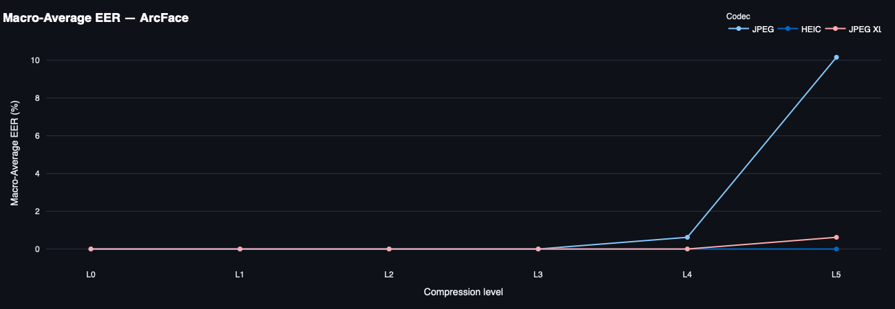
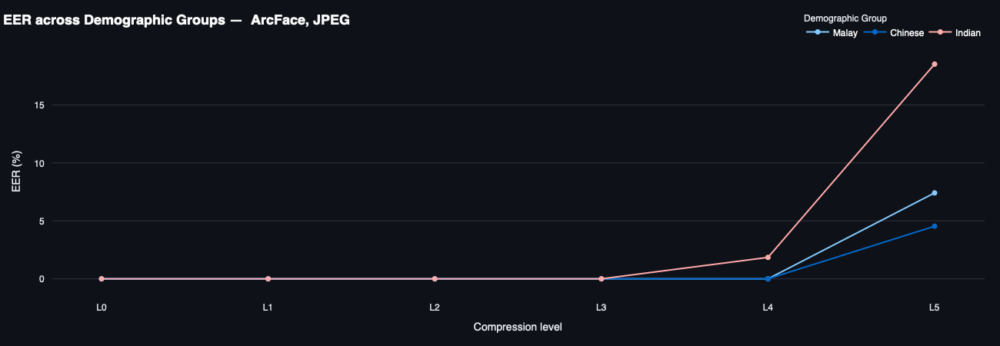
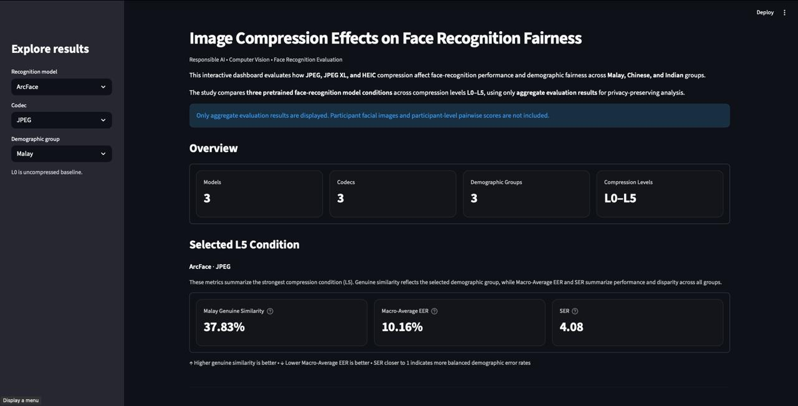

# Image Compression Effects on Face Recognition Fairness

> A Responsible AI and computer vision project evaluating how image compression affects face-recognition performance and demographic fairness across Malaysian Malay, Chinese, and Indian groups.


## Overview

Face-recognition systems often rely on compressed facial images to reduce storage and transmission requirements. While compression improves efficiency, it can also remove or distort identity-related facial information and may not affect all demographic groups equally.

This project evaluates the effect of **JPEG, JPEG XL, and HEIC** compression on face-recognition performance and fairness across three Malaysian demographic groups:

- Malay
- Chinese
- Indian

The study uses three **pretrained** face-recognition model conditions — ArcFace, MobileFaceNet, and MagFace — to extract facial embeddings. The project does **not** train or fine-tune a new face-recognition model.

The evaluation combines similarity-score analysis with threshold-based recognition and fairness metrics, including **FAR, FRR, EER, Macro-Average EER, and SER**.

An interactive **Streamlit dashboard** is included to explore the aggregate results by model, codec, compression level, and demographic group.

## Problem

Image compression is commonly treated as a storage or bandwidth optimization step. In biometric systems, however, aggressive lossy compression can alter facial texture, edges, colour information, and other visual details used by recognition models.

A system may still appear accurate overall while producing higher rejection or acceptance errors for a particular demographic group. This project therefore treats image compression as both a **recognition-performance variable** and a **fairness-sensitive factor**.

## Research Questions and Objectives

The study addresses three main research questions:

1. **How does face-recognition performance change across different compression formats and compression levels?**
2. **Does image compression affect Malay, Chinese, and Indian demographic groups differently?**
3. **Are compression-related performance and fairness patterns consistent across different face-recognition models?**

The project objectives were to:

- apply multiple image-compression formats and levels to a Malaysian demographic facial-image dataset;
- evaluate face-recognition performance using original and compressed images;
- compare the fairness effects of different compression formats across demographic groups and recognition models.

## Experimental Pipeline

```mermaid
flowchart LR
    A[Private Raw Facial Images] --> B[Preprocessing]
    B --> C[112 × 112 PNG Baseline - L0]
    C --> D[Image Compression]

    D --> D1[JPEG L1-L5]
    D --> D2[JPEG XL L1-L5]
    D --> D3[HEIC L1-L5]

    C --> E[Pretrained Face Recognition Models]
    D1 --> E
    D2 --> E
    D3 --> E

    E --> E1[ArcFace Condition]
    E --> E2[MobileFaceNet Condition]
    E --> E3[MagFace Condition]

    E1 --> F[512-D Face Embeddings]
    E2 --> F
    E3 --> F

    F --> G[Cosine Similarity]
    G --> H[Genuine and Intra-Group Impostor Scores]
    H --> I[Group-Specific Impostor Z-Normalization]
    I --> J[FAR / FRR / EER]

    J --> K[Macro-Average EER]
    J --> L[SER]
    J --> M[Demographic Comparison]

    K --> N[Fairness Analysis]
    L --> N
    M --> N

    N --> O[Aggregate Results]
    O --> P[Streamlit Dashboard]
```



The pipeline begins with private facial images that are standardized into a **112 × 112 lossless PNG baseline (L0)**. JPEG, JPEG XL, and HEIC versions from **L1 to L5** are then generated as compressed probe images.

The baseline and compressed images are passed through the three pretrained recognition conditions to extract **512-dimensional face embeddings**. Cosine similarity is used to produce genuine and intra-demographic impostor comparisons. Raw scores are retained for score-level analysis, while **group-specific impostor Z-normalization** is applied before threshold-based calculation of FAR, FRR, and EER.

The resulting recognition metrics are aggregated into **Macro-Average EER**, **SER**, and demographic comparisons before being exported to `results/data/fairness_summary_table.csv` and visualized in the Streamlit dashboard.

### Preprocessing

The preprocessing pipeline standardizes the collected images before compression and recognition evaluation. It uses **MediaPipe Face Mesh** and OpenCV-based quality checks to:

- detect one face per image;
- validate roll, yaw, and pitch;
- reject excessively blurry or dark images;
- isolate the facial region;
- resize accepted images to **112 × 112 pixels**;
- save the standardized baseline as lossless PNG.

<details>
<summary><strong>Preprocessing thresholds used in the experiment</strong></summary>

| Check | Experimental threshold |
|---|---:|
| Maximum roll | 30° |
| Yaw-ratio threshold | 0.05 |
| Maximum pitch ratio | 0.70 |
| Minimum Laplacian variance | 25.0 |
| Minimum mean brightness | 15 |
| Output size | 112 × 112 px |

</details>

## Dataset

The research used a **self-collected, balanced dataset of 162 facial images**:

| Demographic group | Images |
|---|---:|
| Malay | 54 |
| Chinese | 54 |
| Indian | 54 |
| **Total** | **162** |

Participants provided facial images for academic research. Images were organized using demographic labels and coded identifiers, while personal names were not used in the analysis.

The balanced design ensures that no one demographic group dominates the group-level comparison.

## Privacy and Dataset Availability

This is a biometric research project, so participant privacy is treated as a core repository requirement.

The public repository does **not** include:

- participant facial images;
- rejected or preprocessed participant images;
- compressed participant images;
- consent forms or survey responses;
- identifying participant information;
- participant-level embeddings;
- participant-level raw pairwise similarity records.

The public analysis and Streamlit dashboard use only the aggregate file:

```text
results/data/fairness_summary_table.csv
```

Because the original participant data is private, the repository demonstrates the full experimental code and aggregate results but does not provide the biometric dataset required to reproduce the study end-to-end.

## Image Compression

The standardized PNG images are treated as the **L0 baseline**. Each image is then compressed using JPEG, JPEG XL, and HEIC at five increasingly strong compression levels.

| Level | JPEG quality | JPEG XL distance | HEIC setting |
|---|---:|---:|---:|
| L1 | 98 | 0.23 | 0 |
| L2 | 96 | 0.40 | 8 |
| L3 | 80 | 1.40 | 18 |
| L4 | 20 | 6.62 | 28 |
| L5 | 5 | 9.95 | 34 |

- **L0** — standardized uncompressed PNG baseline
- **L1** — weakest compression / highest retained quality in this experiment
- **L5** — strongest compression / lowest retained quality in this experiment

JPEG compression is handled with OpenCV, JPEG XL with `cjxl` / `djxl`, and HEIC with `heif-enc` / `heif-convert` plus the supporting HEVC tools used in the original environment.

## Face Recognition Models

Three pretrained recognition conditions are evaluated. Each produces a **512-dimensional face embedding**.

| Model condition | Implementation in the repository | Output | Role |
|---|---|---:|---|
| ArcFace condition | InsightFace `antelopev2` recognition component | 512-D embedding | Main detailed reference condition |
| MobileFaceNet condition | InsightFace `buffalo_sc` recognition component | 512-D embedding | Tests lightweight-model behaviour under compression |
| MagFace condition | Pretrained `iresnet100` / ResNet-100 with `magface_epoch_00025.pth` | 512-D embedding | Tests quality-aware recognition behaviour |

The report describes ArcFace as the main detailed reference condition and uses MobileFaceNet and MagFace for cross-model comparison. The repository-specific model-pack names above are taken from the implementation notebook. All models are used for **inference and embedding extraction only**; no model is trained or fine-tuned in this project.

## Evaluation Metrics

### Similarity scores

- **Raw Genuine Mean** — similarity between the same identity; higher values indicate stronger identity preservation.
- **Raw Impostor Mean** — similarity between different identities; lower values generally indicate better separation.
- **Normalized scores** — group-specific impostor Z-normalization is applied before threshold-based evaluation.

### Recognition errors

- **FAR — False Acceptance Rate:** impostor comparisons incorrectly accepted as genuine.
- **FRR — False Rejection Rate:** genuine comparisons incorrectly rejected.
- **EER — Equal Error Rate:** operating point where FAR and FRR are equal or as close as possible; lower is better.

### Fairness metrics

- **Macro-Average EER:** arithmetic mean of EER across Malay, Chinese, and Indian groups, giving each group equal weight.
- **EER gap:** difference between the highest and lowest demographic EER.
- **SER — Skewed Error Ratio:** ratio between the highest and lowest demographic EER; values closer to 1 indicate more balanced performance. SER is undefined when the minimum group EER is zero.

The analysis considers both **usability fairness** through genuine scores / FRR and **security fairness** through impostor scores / FAR.

## Results

The main findings are summarized below. The repository also includes an interactive Streamlit dashboard for exploring the complete aggregate result table by model, codec, compression level, and demographic group.

### 1. Compression Impact Under ArcFace

ArcFace was used as the main detailed reference condition in the report. At the strongest tested compression level (L5), JPEG caused the largest reduction in genuine similarity and the largest increase in error rate.

| Codec | Avg. genuine similarity | Macro-Average EER |
|---|---:|---:|
| JPEG L5 | **36.74%** | **10.16%** |
| JPEG XL L5 | **77.02%** | **0.62%** |
| HEIC L5 | **86.54%** | **0.00%** |

> **Interpretation:** JPEG produced the strongest recognition degradation, JPEG XL showed milder degradation, and HEIC maintained the most stable ArcFace performance across the tested compression levels.



*Figure 1. Macro-Average EER across compression levels under ArcFace. Severe JPEG compression produces the largest increase in recognition error, while JPEG XL and HEIC remain more stable.*

### 2. Demographic Fairness Under Severe JPEG Compression

The clearest ArcFace demographic disparity appeared at **JPEG L5**.

| Demographic group | Genuine similarity | EER |
|---|---:|---:|
| Malay | 37.83% | 7.41% |
| Chinese | 38.26% | 4.54% |
| Indian | **34.12%** | **18.52%** |

> **Interpretation:** The largest ArcFace demographic disparity occurred under **JPEG L5**. The Indian group recorded the highest EER at **18.52%**, compared with **7.41%** for Malay and **4.54%** for Chinese. This produced a Macro-Average EER of **10.16%** and a Skewed Error Ratio of **4.08**, showing a clear demographic performance gap under the strongest JPEG compression condition.



*Figure 2. Demographic EER under ArcFace JPEG compression. Demographic differences become most visible under stronger compression, with the Indian group recording the highest EER at L5.*

### 3. Cross-Model Comparison at L5

The compression effect was not identical across ArcFace, MobileFaceNet, and MagFace.

| Model | JPEG | JPEG XL | HEIC |
|---|---:|---:|---:|
| ArcFace | 10.16% | 0.62% | 0.00% |
| MobileFaceNet | 17.84% | 0.47% | 0.00% |
| MagFace | **23.46%** | **6.56%** | **1.49%** |

*Values are Macro-Average EER at L5.*

> **Interpretation:** JPEG L5 was the most damaging compression condition for all three models, but the magnitude of degradation varied by model. HEIC was the most stable overall, although MagFace still recorded a non-zero Macro-Average EER under HEIC L5.

## Key Findings

- **Compression format and strength matter.** Recognition performance changed substantially across codecs and compression levels.
- **Severe JPEG compression produced the clearest degradation.** Under ArcFace, average genuine similarity fell to 36.74% and Macro-Average EER rose to 10.16% at JPEG L5.
- **JPEG XL was more robust than JPEG** under the strongest tested compression level for ArcFace and MobileFaceNet.
- **HEIC was the most stable codec overall**, particularly for ArcFace and MobileFaceNet; however, MagFace still recorded a non-zero Macro-Average EER at HEIC L5.
- **Demographic disparity was condition-dependent rather than universal.** It was absent at baseline and mild compression, but became clearer under severe JPEG compression.
- Under ArcFace JPEG L5, the **Indian group had the highest EER at 18.52%**, compared with 7.41% for Malay and 4.54% for Chinese.
- **Model behaviour was not identical.** ArcFace, MobileFaceNet, and MagFace responded differently to the same compression conditions, showing why compression-fairness evaluation should not rely on a single recognition model.

### Hypothesis outcomes

| Hypothesis | Outcome |
|---|---|
| H1 — Compression level and format influence recognition performance | **Supported** |
| H2 — Compression produces different outcomes across demographic groups | **Partially supported** |
| H3 — Compression-related performance and fairness patterns vary across models | **Supported** |

## Interactive Streamlit Dashboard

The repository includes a Streamlit application for exploring the aggregate evaluation results interactively.



*Interactive dashboard for exploring compression effects, recognition performance, and demographic fairness across model, codec, and demographic conditions.*

> **Live demo:** [Open the interactive Streamlit dashboard](https://face-recognition-compression-fairness-nyxmqeysqrt7b9kh6sajxc.streamlit.app)

The dashboard allows users to filter by:

- recognition model;
- codec;
- demographic group.

It visualizes:

- genuine similarity across compression levels;
- Macro-Average EER;
- FAR vs FRR;
- EER across demographic groups;
- SER where defined;
- detailed aggregate metrics.

The application uses only the aggregate result file:

```text
results/data/fairness_summary_table.csv
```

## Repository Structure

```text
face-recognition-compression-fairness/
│
├── README.md
├── requirements.txt
├── .gitignore
├── streamlit_app.py
│
├── notebooks/
│   ├── 01_image_preprocessing.ipynb
│   ├── 02_image_compression.ipynb
│   ├── 03_embedding_extraction.ipynb
│   └── 04_score_generation_and_fairness.ipynb
│
├── results/
│   └── data/
│       └── fairness_summary_table.csv
│
├── figures/
├── assets/
└── data/                  # private / gitignored
    ├── preprocessed_images/
    ├── compressed_images/
    └── private_results/
```

## Installation

### Python dependencies

Create a virtual environment and install the repository dependencies:

```bash
python -m venv .venv
source .venv/bin/activate
pip install -r requirements.txt
```

On Windows:

```bash
.venv\Scripts\activate
pip install -r requirements.txt
```

### System dependencies

The compression notebooks also use external codec tools, including:

- FFmpeg
- `libheif-examples`
- `libx265-dev`
- JPEG XL `cjxl` / `djxl`

The original experiment was executed in **Google Colab**, and the notebooks contain the environment setup required for that workflow.

## Usage / Notebook Order

Run the notebooks in this order:

```text
01_image_preprocessing.ipynb
        ↓
02_image_compression.ipynb
        ↓
03_embedding_extraction.ipynb
        ↓
04_score_generation_and_fairness.ipynb
```

### 1. Facial image preprocessing

Validates private input images and creates the standardized L0 PNG baseline.

### 2. Image compression

Generates JPEG, JPEG XL, and HEIC probe images for L1–L5.

### 3. Embedding extraction and pairwise scoring

Extracts embeddings using the pretrained recognition models and generates genuine and intra-demographic impostor cosine-similarity comparisons.

The participant-level raw pairwise result is treated as a **private intermediate file**.

### 4. Recognition and fairness evaluation

Performs score normalization, calculates recognition/fairness metrics, and generates the public aggregate result:

```text
results/data/fairness_summary_table.csv
```

### Run the Streamlit dashboard

```bash
streamlit run streamlit_app.py
```

## Limitations

The findings should be interpreted within the scope of the controlled experiment:

- the dataset contains **162 images**, which is balanced but relatively small;
- the demographic scope is limited to Malay, Chinese, and Indian groups;
- ethnicity is used as the demographic grouping, while skin tone, facial reflectance, colour-channel loss, and texture degradation were not measured directly;
- images were standardized before compression, so the experiment does not fully represent uncontrolled conditions such as extreme lighting, motion blur, occlusion, expression changes, camera variation, or surveillance imagery;
- the recognition models were pretrained and were not trained or fine-tuned using compressed images;
- only JPEG, JPEG XL, and HEIC were tested, with five compression levels;
- fairness conclusions depend on the selected metrics and thresholding procedure.

The results therefore provide evidence for the evaluated experimental setting and should not be treated as universal performance claims for all populations or face-recognition systems.

## Future Improvements

Future work identified from the study includes:

- expanding the dataset size;
- evaluating broader demographic representation;
- testing compression under real-world image conditions;
- directly measuring image-quality, skin-tone, colour, and texture changes;
- evaluating additional codecs, bitrates, and finer compression settings;
- investigating compression-aware training or fine-tuning;
- developing practical guidelines for selecting compression settings that balance storage efficiency, recognition reliability, and demographic fairness.

## Technologies

### Research pipeline

- Python
- NumPy
- Pandas
- OpenCV
- MediaPipe Face Mesh
- Pillow / Pillow-HEIF
- scikit-learn
- InsightFace
- ONNX Runtime
- PyTorch
- Torchvision
- JPEG XL (`cjxl`, `djxl`)
- HEIC / HEIF (`heif-enc`, `heif-convert`)
- FFmpeg / libx265
- Google Colab

### Portfolio dashboard

- Streamlit
- Plotly

## Author

**Mohammad Salahuddin bin Burhan**  
Bachelor of Computer Science (Hons.) Data Science  
Faculty of Computing and Informatics  
Multimedia University, Malaysia

Final Year Project — July 2026